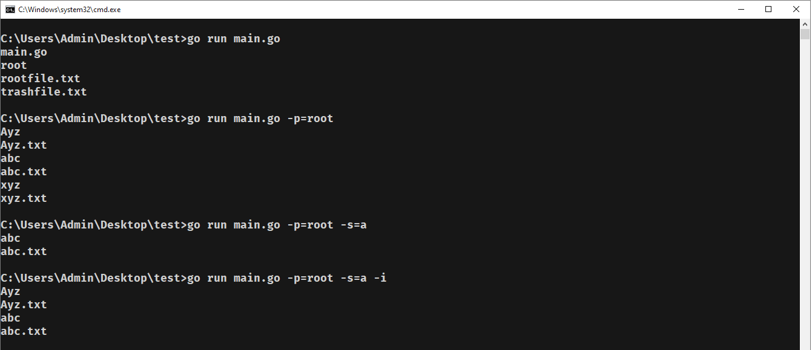
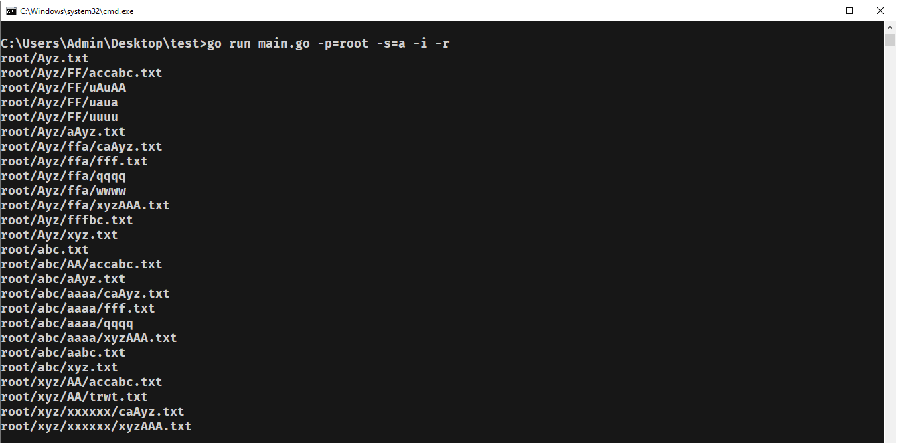

# Find Term in Directory
Find Term in a Directory
## Usage
Run command
```
go run main.go -p=path -s=search_term [-i] [-r]
```
Where `p` is path folder long to find, `s` is term long to search.  
The option `-i` is ignore case (treat upper or lower same `'a' = 'A'`).  
And last option `r` is recursion in case you want it to be nested.  
In default, `p=.` (current); `s=*` (all); `i = r = false`.
## Demo

